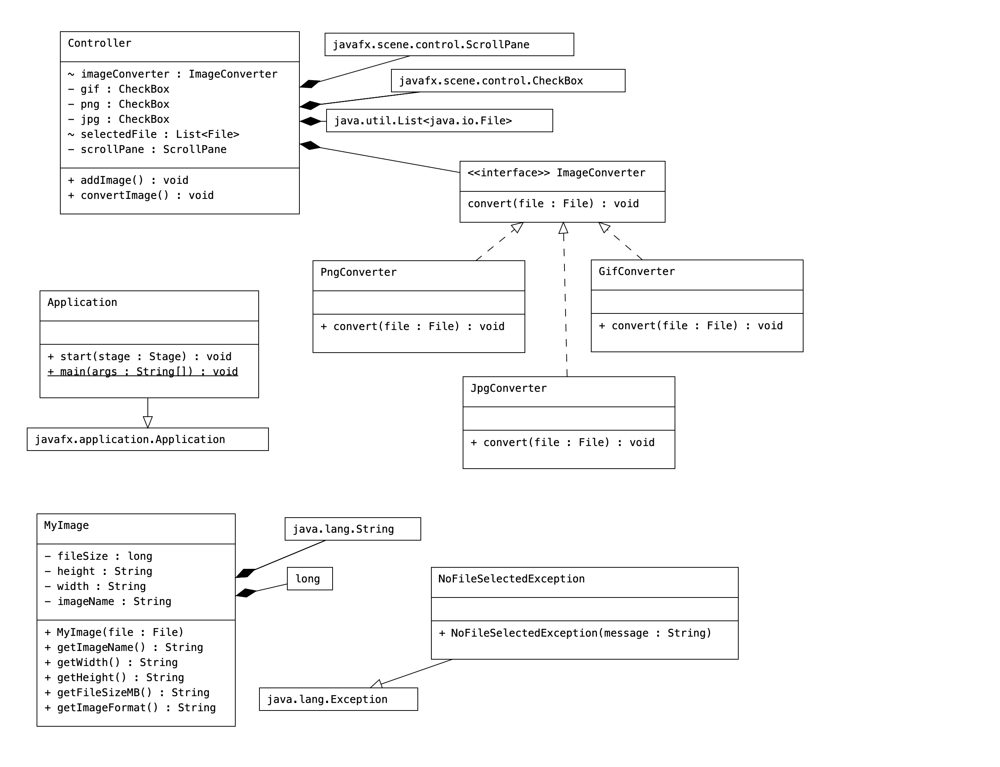

# Image Management Tool
This is INFO 5100 Final Project of an image management tool developed in Java.

Team: Yunlu Hu & Yaning Guo

The tool allows users to upload one or more image files from their desktop, view image thumbnails, and image properties of height, width, size, and type, and convert the images to different formats and download them.

## Usage
1. Clone the repository to your local machine.
2. Run the project using an Integrated Development Environment (IDE) like Eclipse, IntelliJ or Netbeans.
3. Upload one or more image files from the directory you choose in the dialog opened by clicking on the "Add Images" button.
4. The tool displays the thumbnails of the uploaded images with their respective properties.
5. Select the format you want to convert to by clicking on the checkboxes.
6. Click on the "Convert & Save" button to convert the image(s) to the selected formats and download them to the directory you choose in the pop-up dialog.

## Class Diagram

## Design Patterns Used
MVC (Model-View-Controller) pattern is used in this JavaFX project. 

* Model: MyImage class and ImageConverter can be considered part of the Model layer.
* View: view.fxml included to implement user interface.
* Controller: Controller included to handle the upload of images, the conversion and download of images.

## Test Screenshots

